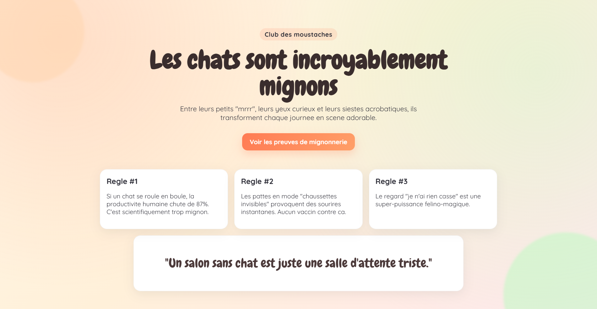

# Demo Web L1 - Les chats sont mignons

Projet de demonstration HTML/CSS pour etudiants de Licence 1 en developpement web.

## Apercu

## Objectif pedagogique

Ce mini-projet sert a montrer, sur un exemple simple et ludique, comment construire une page web statique moderne avec:

- une structure HTML semantique
- une mise en page CSS responsive
- des animations CSS de base
- une separation claire entre contenu (HTML) et presentation (CSS)

## Competences visees (Licence 1)

- Comprendre la structure d'un document HTML5
- Utiliser les balises semantiques: header, main, section, article, footer
- Appliquer des styles avec classes CSS
- Manipuler Flex/Grid (ici CSS Grid) pour organiser des blocs
- Utiliser les media queries pour l'adaptation mobile
- Lire et modifier un code existant sans le casser

## Arborescence

- index.html: structure de la page et contenu
- style.css: theme visuel, animations et responsive
- image.png: capture d'ecran de la demo

## Lancer la demo

1. Ouvrir le dossier du projet dans VS Code.
2. Ouvrir index.html dans un navigateur.
3. Option recommandee en cours: utiliser l'extension "Live Server" pour voir les changements en direct.

## Ce que les etudiants peuvent analyser

### 1) Semantique HTML

- Titres et paragraphes
- Liens d'ancrage (bouton "Voir les preuves de mignonnerie")
- Separation logique des zones de la page

### 2) Construction visuelle CSS

- Variables CSS dans :root
- Fond compose de gradients
- Cartes avec ombres et bords arrondis
- Typographies externes via Google Fonts

### 3) Animation et interaction

- Animations d'apparition (pop-in, rise)
- Animation de decor (drift)
- Effet hover sur le bouton principal

### 4) Responsive design

- Passage de 3 colonnes a 2 colonnes puis 1 colonne
- Ajustements de spacing pour petits ecrans

## Mise a jour "a decommenter" (amelioration guidee)

Le projet contient une amelioration visuelle optionnelle:

- Dans index.html: ajouter la classe party-paws sur la balise body
- Dans style.css: activer le bloc .party-paws::before et son animation si vous l'avez commente

But pedagogique: illustrer le principe "feature toggle" simple via commentaires et decommentage.

## Idees d'exercices en TP

- Exercice 1: changer le theme de couleurs avec vos propres variables CSS
- Exercice 2: ajouter une 4e carte "Regle #4" sans casser la grille
- Exercice 3: remplacer les textes par un autre sujet (chiens, jeux video, musique)
- Exercice 4: ajouter une nouvelle animation sur le footer
- Exercice 5: rendre le bouton CTA plus accessible (contraste, focus visible)

## Points d'evaluation possibles

- Respect de la semantique HTML
- Qualite et lisibilite du CSS
- Fonctionnement responsive
- Pertinence des modifications demandees
- Capacite a expliquer ses choix techniques

## Licence d'usage (cours)

Utilisation libre pour demonstration pedagogique, adaptation et exercices en classe.